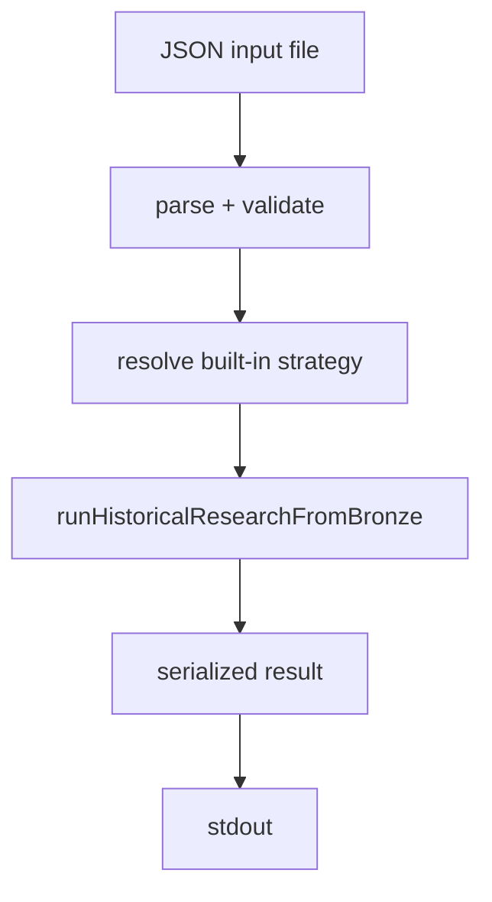

# PR-6.10A — Historical Research CLI Command

## Summary

Milestone 6.10A adds the first executable Node CLI command for running historical research from a JSON input file. The command is a thin wrapper around `runHistoricalResearchFromBronze()` — no trading, dataset, replay, or metrics logic in the script layer.

## Command

```bash
npm run research:historical -- --input path/to/input.json
```

## Pipeline



Errors are written to **stderr** with exit code `1`. Successful runs write the deterministic serialized research result to **stdout** only — no output files.

## Input JSON contract

```json
{
  "runId": "run-001",
  "durationMs": 3000,
  "initialCashCents": 10000,
  "strategyId": "noop",
  "engineConfig": { "...": "..." },
  "bronzeRecords": [ "...RawHistoricalRecord..." ],
  "fillConfig": { "optional": true },
  "metricsConfig": { "optional": true }
}
```

## Built-in strategy limitation

Real strategies are not serializable in JSON yet. The CLI supports only these fixture strategy IDs:

| `strategyId` | Behavior |
|---|---|
| `noop` | Never emits trade intents |
| `buy-first-ask` | Buys 1 YES contract at the step's yes ask when pricing is available |

Any other `strategyId` fails validation. Custom `decide()` functions cannot be supplied via JSON until a future strategy registry milestone.

## Output format

Successful runs write **exactly one JSON document** to stdout (plus a trailing newline). The payload is `result.serialized` from `runHistoricalResearchFromBronze()` — a `stableStringify` document combining dataset, research run, and metadata serializations. Parse stdout as a single JSON value; do not expect NDJSON or multiple documents per run.

When 6.9B `ResearchExportDocument` is available on main, a follow-up can optionally wrap stdout in the export model without changing the core pipeline.

## Files

| File | Role |
|---|---|
| `scripts/research/runHistoricalResearch.ts` | CLI entrypoint |
| `scripts/research/types.ts` | Input schema + built-in strategies |
| `scripts/research/runHistoricalResearch.test.ts` | Command tests |
| `package.json` | `research:historical` script + `tsx` devDependency |

## Tests

- Valid `noop` input → stdout, exit 0
- Valid `buy-first-ask` input → stdout, exit 0
- Missing `--input` path → stderr, exit 1
- Invalid JSON → stderr, exit 1
- Empty `bronzeRecords` → validation error
- Deterministic stdout across repeated runs
- No `writeFile` calls

## Out of scope

- Optimization, parameter sweep, walk-forward, Monte Carlo
- Dashboard, live execution, persistence
- Network and filesystem output (except reading the input path)
- Arbitrary strategy deserialization
