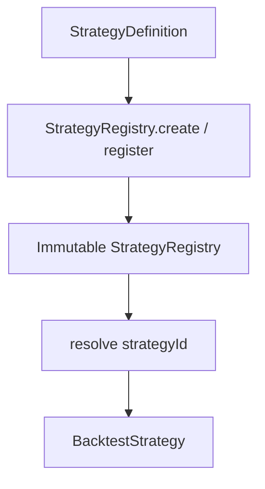

# PR-6.11A — Production Strategy Registry

## Summary

Milestone 6.11A adds `StrategyRegistry` — a deterministic, immutable strategy resolution layer so CLI and research runners can resolve `BacktestStrategy` instances by `strategyId` without embedding fixture logic in script code.

**Registry only** — no new strategy research logic, optimization, dashboard, persistence, network, or live execution.

## Architecture



- No hidden mutable global registry
- `register()` returns a **new** registry instance
- Built-ins available via `StrategyRegistry.createBuiltIn()`

## Public API

```typescript
import {
  StrategyRegistry,
  noopStrategyDefinition,
  buyFirstAskStrategyDefinition,
} from "@/lib/data/strategies";

const registry = StrategyRegistry.createBuiltIn();
const strategy = registry.resolve("noop");

const custom = StrategyRegistry.create()
  .register({
    strategyId: "custom-alpha",
    description: "Example custom strategy",
    strategy: { strategyId: "custom-alpha", decide: () => [] },
  });
```

## Built-in strategies

| `strategyId` | Description |
|---|---|
| `noop` | Never emits trade intents |
| `buy-first-ask` | Buys 1 YES at the step yes ask when pricing is available |

## Error codes

| Code | When |
|---|---|
| `unknown-strategy-id` | `resolve()` called for an unregistered id |
| `duplicate-strategy-id` | `register()` or `create()` receives the same id twice |
| `invalid-strategy-id` | Blank `strategyId` |
| `strategy-id-mismatch` | `definition.strategyId` ≠ `definition.strategy.strategyId` |

## Deterministic guarantees

- `listStrategyIds()` and `snapshot().strategyIds` are lexicographically sorted
- Registry snapshots are deep-frozen
- Built-in `decide()` implementations are pure and deterministic

## CLI integration (future)

`scripts/research/types.ts` still resolves built-in fixture strategies locally via `resolveBuiltinStrategy()`.

**Migration path (6.12A or follow-up):**

```typescript
import { StrategyRegistry } from "@/lib/data/strategies";

const strategy = StrategyRegistry.createBuiltIn().resolve(document.strategyId);
```

No CLI input schema changes are required — only replace the local fixture resolver with the shared registry.

## Tests

`StrategyRegistry.test.ts` covers:

- Resolves `noop` and `buy-first-ask`
- Unknown strategy rejection
- Duplicate strategy rejection
- Deterministic ordering
- Immutable snapshot
- Custom registry creation
- No mutation of prior registry on `register()`
- Deterministic strategy outputs

## Out of scope

- Strategy optimization / parameterization
- Persistence and remote strategy loading
- CLI rewiring (deferred)
- Dashboard / live execution
