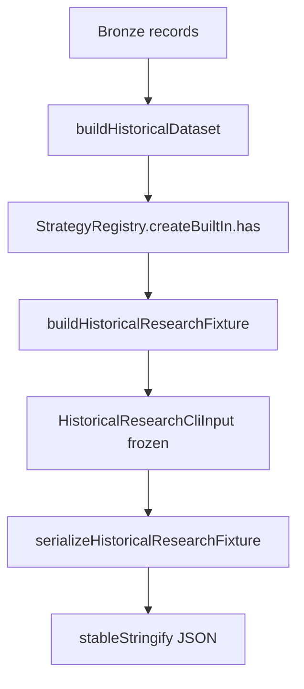

# PR-6.12A — Historical Research Fixture Generator

## Summary

Milestone 6.12A adds a fixture generator that validates bronze records through `buildHistoricalDataset()`, checks built-in `strategyId` values via `StrategyRegistry`, and returns a deeply frozen CLI-shaped research input document.

**Fixture builder only** — no replay execution, runner invocation, metrics calculation, export document generation, CLI wiring, filesystem writes, or networking.

## Pipeline



## Public API

```typescript
import {
  buildHistoricalResearchFixture,
  serializeHistoricalResearchFixture,
} from "@/lib/data/fixtures";

const fixture = buildHistoricalResearchFixture({
  bronzeRecords,
  strategyId: "noop",
  runId: "fixture-run-1",
  durationMs: 4_000,
  initialCashCents: 10_000,
  engineConfig,
  fillConfig,
  metricsConfig,
  exportConfig,
});

const json = serializeHistoricalResearchFixture(fixture);
```

## exportConfig CLI handoff

`exportConfig` is passed through unchanged on the fixture object and in serialized JSON:

```json
{
  "exportConfig": {
    "exportId": "export-fixture-1",
    "generated": { "generatedAt": "2026-06-28T00:00:00.000Z", "label": "fixture" }
  }
}
```

The historical research CLI (`scripts/research/types.ts`) currently expects top-level `exportId` / `generatedAt` fields for `--format export` modes. A follow-up milestone can map `exportConfig` → CLI fields when wiring fixture output into the npm script.

## Rules

- Bronze validated before fixture emission
- Built-in strategy ids only (`noop`, `buy-first-ask`)
- Output deeply frozen (immutable)
- Serialization via `stableStringify` (deterministic key order)
- Input bronze records are cloned, never mutated

## Out of scope

- Replay / runner / ledger / metrics execution
- Export document builders
- CLI command changes
- Filesystem writes
- Custom strategy plugin loading

## Quality gates

```bash
npm run lint
npm run test
npm run build
```
