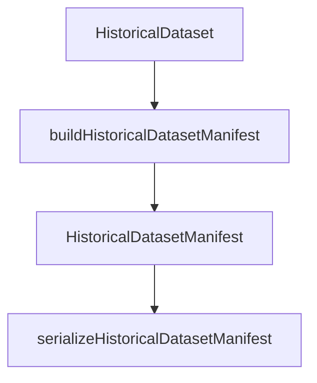

# PR-6.13A — Historical Dataset Manifest Builder

## Summary

Milestone 6.13A adds `buildHistoricalDatasetManifest()` — a deterministic metadata-only summarizer for `HistoricalDataset` objects.

**Metadata only** — no dataset building, validation, replay, research execution, exports, CLI, filesystem, or networking.

## Pipeline



## Public API

```typescript
import {
  buildHistoricalDatasetManifest,
  serializeHistoricalDatasetManifest,
} from "@/lib/data/datasets/manifest";

const manifest = buildHistoricalDatasetManifest({
  dataset,
  generatedMetadata: {
    generatedAt: "2026-06-28T01:00:00.000Z",
    generatedBy: "builder-1",
    label: "catalog-entry",
    source: "manual",
  },
});
```

## Manifest fields

| Field | Source |
|---|---|
| `datasetId` | `dataset.metadata.datasetId` |
| `contractVersion` | `dataset.metadata.contractVersion` |
| `snapshotCount` | `dataset.metadata.snapshotCount` |
| `marketCount` | Unique sorted market tickers |
| `marketTickers` | Lexicographically sorted unique tickers |
| `earliestTimestamp` | Minimum snapshot `temporal.eventTime` |
| `latestTimestamp` | Maximum snapshot `temporal.eventTime` |
| `btcBarCount` | Sum of `snapshot.btcBars.length` |
| `marketWindowCount` | Snapshot count (one window per snapshot) |
| `settlementCount` | Snapshots with non-null settlement |
| `generatedMetadata` | Caller-supplied only |

## Deterministic guarantees

- No `Date.now()`, `Math.random()`, UUID, or `crypto.randomUUID()`
- `marketTickers` sorted lexicographically
- `serializeHistoricalDatasetManifest()` uses `stableStringify`
- Deep-frozen manifest outputs
- Input dataset is never mutated

## Tests

`HistoricalDatasetManifest.test.ts` covers:

- Happy path
- Multiple markets
- Deterministic serialization
- Immutable output
- Sorted market tickers
- Metadata passthrough
- Dataset unchanged
- Repeated builds identical

## Out of scope

Dataset validation, building, replay, runner, ledger, metrics, optimization, CLI, research, exports, filesystem, networking, persistence.

## Future integration

Manifests can feed CLI catalogs, reporting, fixtures, exports, and future dataset caching without re-scanning snapshot payloads.
