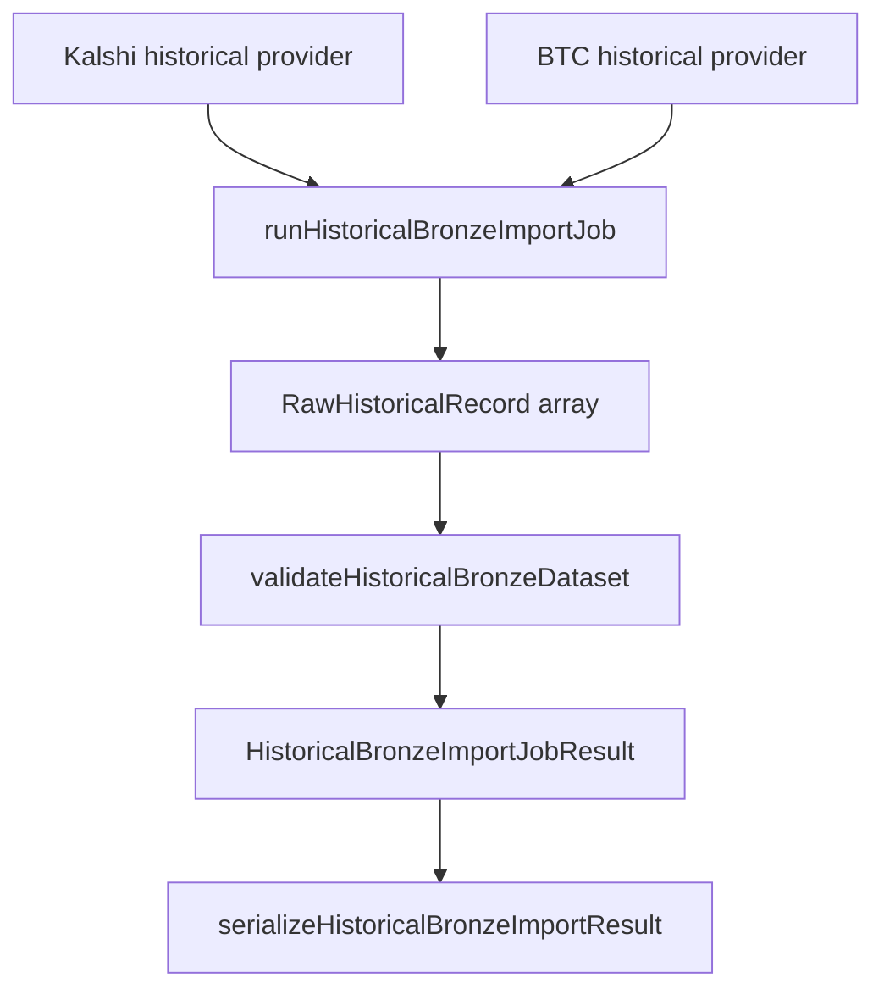

# PR-6.14A — Historical Bronze Import Job

## Summary

Milestone 6.14A adds `runHistoricalBronzeImportJob()` — the first provider-orchestrated import job that assembles a complete `RawHistoricalRecord[]` bronze set suitable for validation, fixture generation, and historical research.

**Import orchestration only** — no direct HTTP, filesystem, networking, persistence, repair, replay, or backtest execution.

## Pipeline



## Public API

```typescript
import {
  runHistoricalBronzeImportJob,
  serializeHistoricalBronzeImportResult,
} from "@/lib/data/importJobs";

const result = runHistoricalBronzeImportJob({
  jobId: "bronze-import-001",
  marketTicker: "KXBTC15M-26JUN",
  startTime: "2026-06-26T23:15:00.000Z",
  endTime: "2026-06-26T23:30:00.000Z",
  collectionTime: "2026-06-27T01:00:00.000Z",
  observedAt: "2026-06-27T01:00:05.000Z",
  kalshiProvider,
  btcProvider,
});
```

## Provider interfaces

| Provider | Method | Returns |
|---|---|---|
| Kalshi | `importKalshiMarketRecords(input)` | `RawHistoricalRecord[]` |
| Kalshi | `importKalshiCandleRecords(input)` | `RawHistoricalRecord[]` |
| Kalshi | `importKalshiSettlementRecords(input)` | `RawHistoricalRecord[]` |
| BTC | `importBtcKlineRecords(input)` | `RawHistoricalRecord[]` |

Each provider receives `{ marketTicker, startTime, endTime, collectionTime, observedAt }`.

## Result shape

| Field | Description |
|---|---|
| `jobId` | Caller-supplied job identifier |
| `bronzeRecords` | Sorted, cloned, deep-frozen bronze records |
| `validationResult` | Output of `validateHistoricalBronzeDataset()` |
| `metadata` | Job summary including `bronzeRecordCount` and `valid` |
| `serialized` | Deterministic JSON via `stableStringify()` |

## Record ordering

Bronze records are sorted deterministically:

1. `eventTime`
2. `collectionTime`
3. `ticker`
4. `contentType`
5. `recordId`

## Deterministic guarantees

- No `Date.now()`, `Math.random()`, UUID, or `crypto.randomUUID()`
- Caller supplies `collectionTime` and `observedAt`
- Provider interfaces only — no direct HTTP or filesystem
- Deep-frozen outputs; input job config is never mutated
- Records cloned via `cloneBronzeRecord()` before sorting

## Tests

`HistoricalBronzeImportJob.test.ts` covers:

- Happy path complete bronze set
- Each provider called once
- Deterministic ordering
- Validation result included
- Incomplete provider output produces invalid validation
- Provider error propagation
- Deterministic serialization
- Immutable output
- Input unchanged
- No filesystem/network (provider-interface orchestration only)

## Out of scope

Dataset repair, persistence, replay, backtest execution, CLI, filesystem, networking, metrics, runner, exports.

## Future integration

Concrete Kalshi/BTC fetch adapters can implement the provider interfaces and feed `runHistoricalBronzeImportJob()` from CLI or scheduled jobs without changing the orchestration contract.
