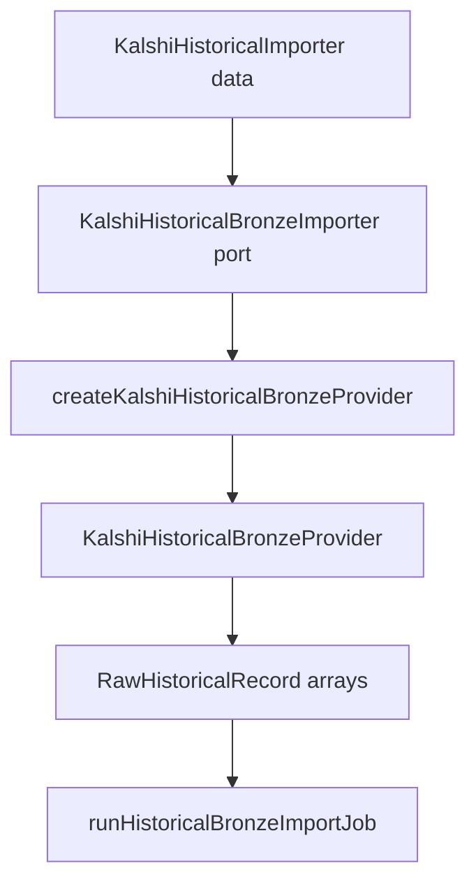

# PR-6.15A — Kalshi Historical Bronze Provider

## Summary

Milestone 6.15A adds `createKalshiHistoricalBronzeProvider()` — the first real Kalshi provider implementation for `runHistoricalBronzeImportJob()`.

The provider adapts existing Kalshi historical importer data and bronze mappers into the sync `KalshiHistoricalBronzeProvider` contract introduced in 6.14A.

**Provider implementation only** — no direct HTTP, filesystem, persistence, CLI, or network integration tests.

## Pipeline



## Public API

```typescript
import { createKalshiHistoricalBronzeProvider } from "@/lib/data/importJobs/providers/kalshi";

const kalshiProvider = createKalshiHistoricalBronzeProvider({
  importer,
  collectionTime: "2026-06-27T01:00:00.000Z",
  observedAt: "2026-06-27T01:00:05.000Z",
});
```

## Importer port

`KalshiHistoricalBronzeImporter` is a synchronous port mirroring the subset of `HistoricalImporter` needed for bronze import:

| Method | Used for |
|---|---|
| `getMarketByTicker(ticker, dateRange)` | `importKalshiMarketRecords` |
| `getMarketCandlesticks(ticker, dateRange)` | `importKalshiCandleRecords` |
| `getSettlementResult(ticker)` | `importKalshiSettlementRecords` |

Production wiring can adapt pre-fetched `HistoricalImporter` responses into this port without changing the import job contract.

## Mapping

- Reuses `mapKalshiMarketPayloadToBronzeRecord`
- Reuses `mapKalshiCandlestickPayloadToBronzeRecord`
- Reuses `mapKalshiSettlementPayloadToBronzeRecord`
- Reuses `eventTimeFromMarketWire` and `kalshiUnixSecondsToEventTime`
- Request paths from `buildHistoricalMarketPath` / `buildHistoricalCandlesticksPath`

## Deterministic guarantees

- No `Date.now()`, `Math.random()`, UUID, or `crypto.randomUUID()`
- Caller-supplied `collectionTime`, `observedAt`, `marketTicker`, `startTime`, `endTime`
- Deterministic record IDs from existing bronze mappers
- Deterministic record ordering within each provider method
- Stable repeated output from identical mocked importer responses

## Tests

`KalshiHistoricalBronzeProvider.test.ts` covers:

- Market, candle, and settlement records imported and mapped
- Importer called with correct ticker/time range
- Deterministic output ordering
- No global fetch
- Importer error propagation
- Empty importer response returns `[]`
- Malformed importer response propagates mapping error
- Input unchanged

## Out of scope

Real network integration tests, API key management, retries, pagination beyond existing importer support, BTC provider, CLI, filesystem writing, backtesting execution.

## Future integration

An async CLI layer can prefetch via `KalshiHistoricalImporter` + `KalshiHistoricalHttpAdapter`, adapt results into `KalshiHistoricalBronzeImporter`, and pass the provider to `runHistoricalBronzeImportJob()`.
