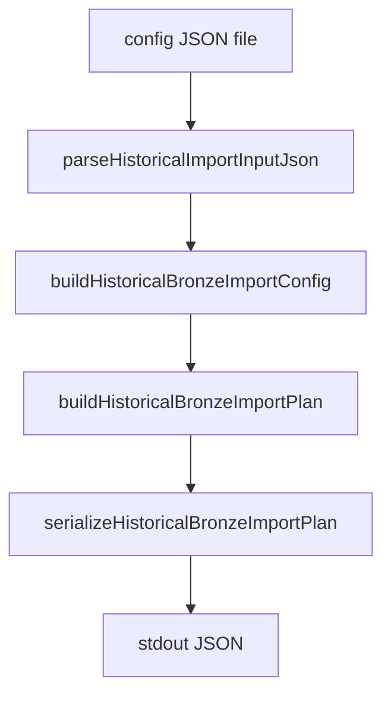

# PR-6.16A — Historical Import CLI Command

## Summary

Milestone 6.16A adds the executable CLI shell for historical bronze import configs.

**Dry-run only** — validates import config JSON and emits a deterministic import plan. No provider calls, HTTP, filesystem writes, bronze generation, or validation execution.

## Pipeline



## CLI

```bash
npm run import:historical -- --input path/to/config.json
npm run import:historical -- --input path/to/config.json --dry-run
```

## Plan output fields

| Field | Description |
|---|---|
| `jobId` | Import job identifier |
| `marketTicker` | Target market ticker |
| `startTime` / `endTime` | Import window |
| `providerSelections` | Kalshi + BTC provider/source selections from config |
| `outputSelections` | Output format and artifact flags |
| `serializedConfig` | Deterministic JSON from `serializeHistoricalBronzeImportConfig()` |
| `dryRun` | Always `true` in this milestone |

## Rules

- Reads config JSON from `--input <path>` only (no writes)
- Success → stdout JSON + exit code `0`
- Failure → stderr message + exit code `1`
- No `Date.now()`, `Math.random()`, provider calls, or filesystem writes
- Reuses 6.14B `buildHistoricalBronzeImportConfig()` for validation

## Tests

`scripts/import/runHistoricalImport.test.ts` covers:

- Valid config
- Missing input
- Invalid JSON
- Invalid config
- Deterministic stdout
- `JSON.parse` stdout
- stderr on failure
- No `writeFile` calls
- `--dry-run` accepted

## Out of scope

Real provider calls, HTTP, filesystem writes, bronze generation, validation execution, API keys, retries.

## Future integration

When provider wiring lands, the same CLI can drop `dryRun: true` and invoke `runHistoricalBronzeImportJob()` without changing the config/plan contract.

## Quality gates

```bash
npm run lint
npm run test
npm run build
```
