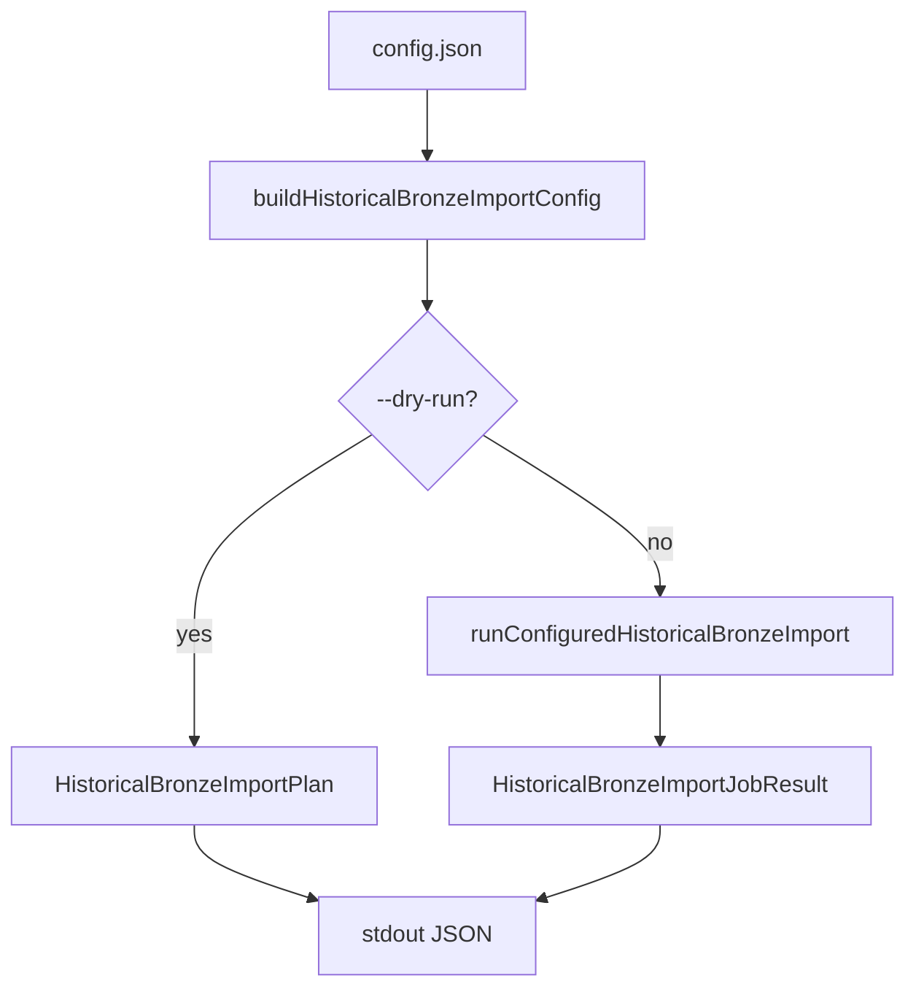

# PR-6.17A — Historical Import Execute Mode

## Summary

Milestone 6.17A upgrades the historical import CLI from dry-run-only to real execution via `runConfiguredHistoricalBronzeImport()` (6.16B harness).

**Execute mode uses caller-supplied providers only** — no HTTP, provider construction, filesystem writes, or generated timestamps.

## Pipeline



## CLI behavior

| Mode | Flag | Output |
|---|---|---|
| Dry-run | `--dry-run` | `HistoricalBronzeImportPlan` JSON (unchanged from 6.16A) |
| Execute | *(none)* | `HistoricalBronzeImportJobResult.serialized` JSON |

```bash
npm run import:historical -- --input path/to/config.json --dry-run
npm run import:historical -- --input path/to/config.json
```

Execute mode requires injected `kalshiProvider` and `btcProvider` via `runHistoricalImportCommand(argv, io, deps)`. The CLI entrypoint does not construct providers.

## Dependencies

| Milestone | Role |
|---|---|
| 6.14B | `buildHistoricalBronzeImportConfig()` |
| 6.14A | `runHistoricalBronzeImportJob()` |
| 6.16A | CLI shell, dry-run plan |
| 6.16B | `runConfiguredHistoricalBronzeImport()` harness |

## Tests

`scripts/import/runHistoricalImport.test.ts` covers:

- Dry-run unchanged (`--dry-run`)
- Execute mode with injected providers
- Provider called once per import method
- Deterministic stdout
- Provider error propagation
- stdout JSON parseable
- stderr on failure
- Immutable frozen harness output
- No `writeFile` calls

## Out of scope

HTTP, provider construction, filesystem writes, timestamp generation, validation beyond existing modules.

## Quality gates

```bash
npm run lint
npm run test
npm run build
```
