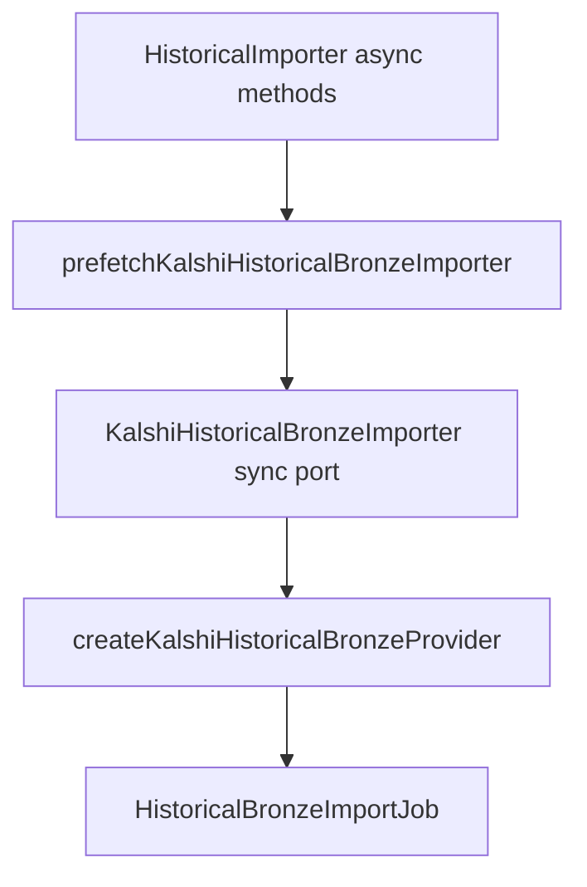

# PR-6.18A — Kalshi Async Prefetch Adapter

## Summary

Milestone 6.18A adds `prefetchKalshiHistoricalBronzeImporter()` and `createPrefetchedKalshiHistoricalBronzeProvider()` — a bridge from the async `HistoricalImporter` stack into the sync `KalshiHistoricalBronzeImporter` port used by `createKalshiHistoricalBronzeProvider()`.

**Adapter only** — no new HTTP logic, filesystem writes, import job execution, dataset building, validation, or replay/backtest.

## Pipeline



## Public API

```typescript
import {
  prefetchKalshiHistoricalBronzeImporter,
  createPrefetchedKalshiHistoricalBronzeProvider,
} from "@/lib/data/importJobs/providers/kalshi/prefetch";

const syncImporter = await prefetchKalshiHistoricalBronzeImporter({
  importer,
  marketTicker: "KXBTC15M-26JUN270115-15",
  startTime: "2026-06-26T23:15:00.000Z",
  endTime: "2026-06-26T23:30:00.000Z",
});

const provider = await createPrefetchedKalshiHistoricalBronzeProvider({
  importer,
  marketTicker: "KXBTC15M-26JUN270115-15",
  startTime: "2026-06-26T23:15:00.000Z",
  endTime: "2026-06-26T23:30:00.000Z",
  collectionTime: "2026-06-27T01:00:00.000Z",
  observedAt: "2026-06-27T01:00:05.000Z",
});
```

## Prefetch behavior

| Async call | Purpose |
|---|---|
| `listHistoricalMarkets(seriesTicker, dateRange)` | Resolve market metadata (series from ticker prefix) |
| `getMarketCandlesticks(marketTicker, 1, dateRange)` | Prefetch 1-minute candles |
| `getSettlementResult(marketTicker)` | Prefetch settlement |

Each endpoint is called **exactly once**. Results are deep-frozen and served deterministically from the sync port.

## Empty / error handling

- No matching market in the markets page → `getMarketByTicker` returns `null`
- Empty settlement (`settlementTs` or `expirationValue` blank) → `getSettlementResult` returns `null`
- Empty candlesticks array → valid empty `HistoricalCandlesticksResult`
- Importer errors propagate unchanged

## Deterministic guarantees

- No `Date.now()`, `Math.random()`, or global `fetch`
- Caller-supplied `marketTicker`, `startTime`, `endTime`, `collectionTime`, `observedAt`
- Immutable prefetched state via `deepFreeze`
- Repeated sync reads return identical values

## Tests

`KalshiHistoricalPrefetchAdapter.test.ts` covers:

- Prefetches market, candles, and settlement once each
- Sync port serves prefetched market, candles, and settlement
- Creates `KalshiHistoricalBronzeProvider` from prefetched importer
- Importer error propagation
- Empty market → `null`
- Empty settlement → `null`
- Deterministic repeated sync reads
- Immutable prefetched state
- Input unchanged
- No global fetch

## Out of scope

New HTTP/fetch code, filesystem writes, import job execution, dataset building, bronze validation, replay/backtest, CLI wiring.

## Future integration

Execute-mode CLI (6.17A+) can construct a `KalshiHistoricalImporter` + HTTP adapter, prefetch via this adapter, and pass the resulting provider to `runConfiguredHistoricalBronzeImport()`.
