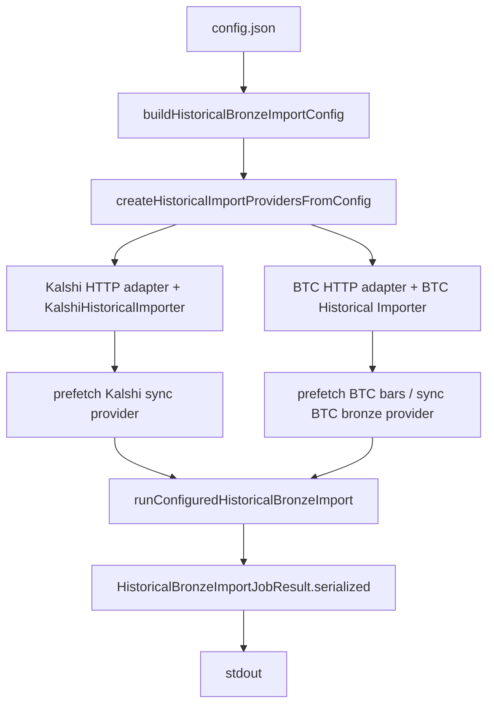

# PR-6.19A — Historical Import Provider Bootstrap

## Summary

Milestone 6.19A wires the historical import CLI execute path to construct real Kalshi and BTC bronze providers from a validated import config.

`npm run import:historical -- --input config.json` no longer requires manually injected providers. When deps are omitted, the CLI bootstraps HTTP adapters, importers, prefetch layers, and runs `runConfiguredHistoricalBronzeImport()`.

**Bootstrap layer only** — no new HTTP endpoints, filesystem writes, persistence, dashboard/UI, or replay/backtest changes.

## Pipeline



## Public API

```typescript
import {
  createHistoricalImportProvidersFromConfig,
  runHistoricalImportFromConfig,
} from "@/lib/data/importJobs/bootstrap";

const deps = await createHistoricalImportProvidersFromConfig({
  config,
  fetchImpl, // optional; defaults to global fetch in production
});

const result = await runHistoricalImportFromConfig({ config, fetchImpl });
```

## CLI behavior

| Mode | Behavior |
|---|---|
| `--dry-run` | Unchanged — prints import plan JSON to stdout |
| Execute + injected deps | Uses provided `kalshiProvider` / `btcProvider` |
| Execute (no deps) | Bootstraps providers via `runHistoricalImportFromConfig()` |

Stdout only on success. Stderr only on failure. No output files.

## Provider construction

**Kalshi**
- `KalshiHistoricalHttpAdapter` + `KalshiHistoricalImporter`
- `createPrefetchedKalshiHistoricalBronzeProvider()`
- Importer `now` uses `config.collectionTime` (no `Date.now()`)

**BTC**
- `BtcHistoricalHttpAdapter` + `createBtcHistoricalImporter()`
- Bars fetched once via `getHistoricalBars()`
- Sync prefetched importer + `createBtcHistoricalBronzeProviderFromImporter()`

## Deterministic guarantees

- No `Date.now()`, `Math.random()`, or generated timestamps
- Caller-supplied config timestamps drive provenance and import input
- `fetchImpl` injectable for tests (no global fetch in tests)

## Tests

`HistoricalImportBootstrap.test.ts` and updated `runHistoricalImport.test.ts` cover:

- Dry-run unchanged
- Execute with injected deps still works
- Execute without deps constructs providers from mocked fetch
- Kalshi/BTC adapter and importer wiring
- Injected `fetchImpl`; no global fetch in tests
- Deterministic JSON stdout
- Bootstrap/provider errors propagate to stderr
- No `writeFile` calls
- Config input unchanged
- Unsupported provider rejected by config builder
- Stdout is `JSON.parse`-able

## Out of scope

New HTTP endpoints, filesystem writes, persistence, dashboard/UI, replay/backtesting/research changes.

## Future integration

Production CLI uses default `globalThis.fetch`. Execute mode can later add API key headers via adapter options without changing the import job contract.
