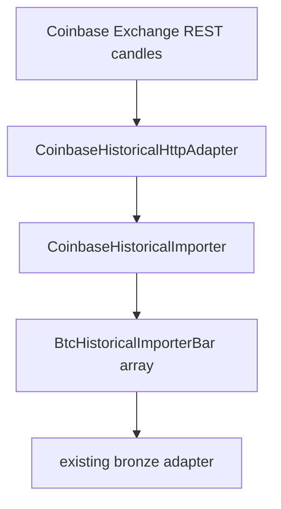

# PR-6.20A — Coinbase Historical BTC Importer

## Summary

Milestone 6.20A adds `createCoinbaseHistoricalImporter()` — a production Coinbase Exchange historical BTC importer implementing the existing `BtcHistoricalImporter` contract.

This gives the historical import pipeline a second production BTC data source independent of Binance.

**Importer only** — no bootstrap, CLI, config builder, bronze provider, import job, validator, replay, or research changes.

## Pipeline



## Public API

```typescript
import {
  createCoinbaseHistoricalImporter,
  CoinbaseHistoricalHttpAdapter,
} from "@/lib/data/importers/btc/coinbase";

const httpClient = new CoinbaseHistoricalHttpAdapter({ fetchImpl });
const importer = createCoinbaseHistoricalImporter({ httpClient });

const bars = await importer.getHistoricalBars({
  symbol: "BTC-USD",
  interval: "1m",
  startTime: "2026-06-26T23:15:00.000Z",
  endTime: "2026-06-26T23:30:00.000Z",
});
```

## HTTP

- Endpoint: `GET /products/BTC-USD/candles`
- `granularity=60` for 1-minute candles
- Injectable `fetchImpl` (no global fetch in tests)

## Window handling

Coinbase limits responses to 300 candles per request. The importer:

1. Splits requested windows into `<=300` candle chunks
2. Fetches chunks sequentially
3. Merges responses
4. Deduplicates by `openTime`
5. Filters to `startTime <= openTime < endTime`
6. Sorts by `openTime`

## Mapping

Coinbase row shape: `[time, low, high, open, close, volume]`

Maps into existing `BtcHistoricalImporterBar` with `source: coinbase-spot`. Reuses the same OHLC/volume validation patterns as the Binance importer. Output is deep-frozen.

## Tests

`CoinbaseHistoricalImporter.test.ts` covers:

- Single and multiple candles
- Request chunking over >300 candles
- Merged chunk ordering
- Duplicate candle removal
- Window filtering
- Deterministic ordering
- Malformed response / invalid timestamps / OHLC / volume
- HTTP error propagation
- Injected fetch, no global fetch
- Immutable output
- Real-shaped Coinbase fixture rows

## Out of scope

Bootstrap wiring, CLI provider selection, config builder changes, bronze providers, import jobs, validators, replay, research, persistence, filesystem writes.

## Future integration

Bootstrap (6.19B+) can select `createCoinbaseHistoricalImporter()` when `btc.provider` is `coinbase-spot`.
