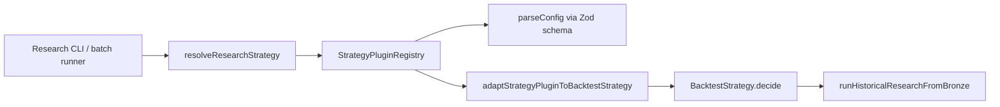

# PR 6.24A — Strategy Plugin Interface

## Summary

Milestone 6.24A adds a strategy **plugin** layer on top of the existing `BacktestStrategy` contract so research runs can resolve interchangeable strategies by `strategyId` with validated config, initialization, and deterministic per-step state — without changing the replay/backtest engine core.

## Architecture



### Plugin contract (`StrategyPlugin`)

| Concern | Location |
|--------|----------|
| `strategyId` + description | `StrategyPlugin.strategyId`, `.description` |
| Config schema | `StrategyPlugin.configSchema` (Zod) |
| Initialization | `StrategyPlugin.createInitialState(config)` |
| Per-tick decision | `StrategyPlugin.decide({ step, context, config, state })` |
| Emitted actions | `StrategyPluginDecisionResult.intents` (`TradeIntent[]`) |
| Deterministic state | `nextState` returned each tick; adapter deep-freezes state |

Built-in plugins live under `src/lib/data/strategies/plugin/builtins/`:

- `noop` — empty config, never emits intents
- `buy-first-ask` — empty config, buys one YES at the step ask when pricing exists

`StrategyRegistry` (6.11A) remains available for simple `BacktestStrategy` resolution without config. Research CLIs now use `resolveResearchStrategy()` from the plugin layer.

## Research wiring

`scripts/research/types.ts` delegates `resolveBuiltinStrategy()` to `resolveResearchStrategy()`. Research input JSON accepts an optional `strategyConfig` object (defaults to `{}`).

```ts
import { resolveResearchStrategy } from "@/lib/data/strategies";

const strategy = resolveResearchStrategy({
  strategyId: document.strategyId,
  strategyConfig: document.strategyConfig,
});
```

## Adding a future strategy

1. Define a Zod config schema and implement `StrategyPlugin` in `src/lib/data/strategies/plugin/builtins/` (or a feature module).
2. Register it on a custom registry for tests, or extend `BUILTIN_PLUGINS` in `StrategyPluginRegistry.ts` when promoting to built-in.
3. Optionally register a `StrategyDefinition` on `StrategyRegistry` for fixture validation if the strategy is built-in.
4. Pass `strategyId` and `strategyConfig` in research fixture JSON.

Example skeleton:

```ts
import { z } from "zod";
import type { StrategyPlugin } from "@/lib/data/strategies";

const myConfigSchema = z.object({ threshold: z.number().finite() }).strict();

export const myStrategyPlugin: StrategyPlugin<z.infer<typeof myConfigSchema>> = {
  strategyId: "my-strategy",
  description: "Example plugin",
  configSchema: myConfigSchema,
  createInitialState: () => ({ seen: 0 }),
  decide: ({ step, context, config, state }) => ({
    intents: [],
    nextState: { seen: Number(state.seen) + 1 },
  }),
};
```

No changes to `BacktestStrategyRunner`, bronze import, dataset discovery, or batch runners are required beyond strategy resolution.

## Tests

`src/lib/data/strategies/plugin/resolveResearchStrategy.test.ts` covers:

- Built-in plugin resolution
- Unknown strategy rejection
- Invalid config rejection
- Custom plugin registration
- Deterministic state via adapter
- `resolveResearchStrategy` DI via custom registry

Existing `StrategyRegistry.test.ts` and research CLI tests remain unchanged in behavior.

## Files

| Path | Role |
|------|------|
| `src/lib/data/strategies/plugin/` | Plugin types, registry, adapter, resolver |
| `src/lib/data/strategies/builtins/buyFirstAskIntent.ts` | Shared intent helper |
| `scripts/research/types.ts` | Delegates to `resolveResearchStrategy` |
| `scripts/research/runHistoricalResearch.ts` | Passes `strategyConfig` |
| `scripts/research/runBatchResearch.ts` | Passes `strategyConfig` |
