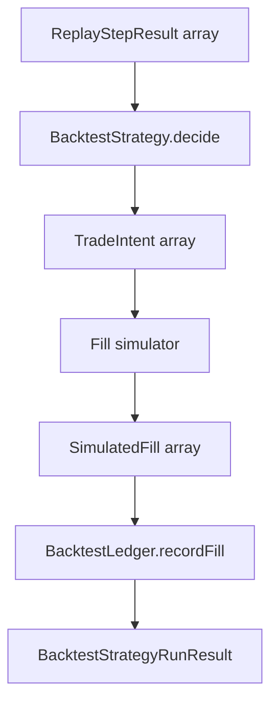

# PR-6.5C — Backtest Strategy Runner Core

## Summary

Milestone 6.5C adds a deterministic strategy runner that converts `ReplayStepResult[]` outputs into simulated `TradeFill` inputs for `BacktestLedger`.

**Runner infrastructure only** — no metrics, optimization, dashboard, persistence, network, or live execution.

## Scope

| In scope | Out of scope |
|---|---|
| `BacktestStrategy` interface | Sharpe, CAGR, drawdown (6.5B) |
| `BacktestStrategyRunner` | Parameter optimization |
| Deterministic fill simulation | Monte Carlo |
| Ledger integration | Dashboard UI |
| Per-step runner results | Persistence |
| Explicit fee config | Slippage, partial fills, order queue |
| | Orderbook depth simulation |
| | Execution latency / market impact |
| | Live execution / Kalshi API |
| | Trading engine changes |

## Pipeline



## Strategy interface

```typescript
interface BacktestStrategy {
  strategyId: string;
  decide(step: ReplayStepResult, context: BacktestStrategyContext): TradeIntent[];
}

type BacktestStrategyContext = {
  stepIndex: number;
  ledgerSnapshot: LedgerSnapshot;
  openPositions: readonly OpenPosition[];
  cashCents: number;
};
```

Strategies receive the current ledger snapshot **before** each replay step. They return zero or more `TradeIntent` objects; the runner simulates and applies them in declaration order.

## Fill simulation assumptions

- **Price source:** `engine-input-pricing` only — prices come from `ReplayStepResult.engineInput.pricing`
- **Buy fills** execute at the side ask (`yesAskCents` / `noAskCents`)
- **Sell fills** execute at the side bid (`yesBidCents` / `noBidCents`)
- **Limit checks:** buys require `ask <= limitPriceCents`; sells require `bid >= limitPriceCents`
- **Ticker guard:** intent ticker must match `ReplayStepResult.sourceTicker`
- **Timestamps:** `occurredAt` is `engineInput.evaluatedAt` (caller/replay supplied; no hidden clock)
- **Partial fills:** disabled (`allowPartialFills: false`)
- **No invented prices:** missing pricing or missing bid/ask rejects the intent deterministically

## Fee model

```typescript
type BacktestFillSimulationConfig = {
  feeCentsPerContract: number;
  allowPartialFills: false;
  priceSource: "engine-input-pricing";
};
```

`feeCents = feeCentsPerContract × quantity` per accepted fill. Fees debit cash on buys and reduce proceeds on sells via ledger accounting.

## Deterministic guarantees

- Caller-supplied `ReplayStepResult[]` order is preserved (not re-sorted by `stepIndex`)
- Intent IDs: `intent-000001`, `intent-000002`, …
- Simulated fill IDs: `sim-fill-000001`, `sim-fill-000002`, …
- Invalid and unfillable intents are collected as `rejectedIntents` with stable codes (no throws for per-intent failures)
- Prior ledger snapshots and replay step inputs are not mutated
- Identical inputs produce identical `BacktestStrategyRunResult`

## Quality gates

```bash
npm run lint
npm run test
npm run build
```

## Handoff notes for metrics milestone (6.5B)

- Consume `BacktestStrategyRunResult.ledger` for final cash, realized P/L, and fill history
- Use `ReplayStepResult.engineInput` / per-step `acceptedFills` if step-level analytics are needed
- Do **not** embed metrics inside the runner; 6.5B should remain a separate module over ledger + run outputs
- `computeUnrealizedPnL()` on `BacktestLedger` remains the mark-price primitive for open positions
