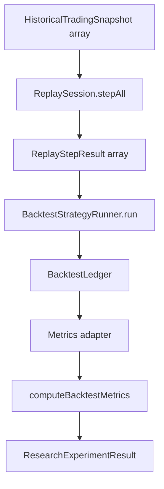

# PR-6.6A — Research Experiment Framework

## Summary

Milestone 6.6A adds a deterministic research experiment orchestrator under `src/lib/data/research/` that runs a configured strategy over historical snapshots and returns a complete experiment result.

**Orchestration only** — no optimization, parameter search, dashboard, persistence, network, or live execution.

## Architecture

| Layer | Module | Role |
|---|---|---|
| Input | `HistoricalTradingSnapshot[]` | Caller-supplied historical data |
| Replay | `ReplaySession` | Deterministic engine evaluation per step |
| Execution | `BacktestStrategyRunner` | Strategy intents → simulated fills → ledger |
| Accounting | `BacktestLedger` | Cash, positions, realized P/L |
| Analytics | `computeBacktestMetrics` | Equity curve + closed-trade summary |
| Output | `ResearchExperimentResult` | Frozen experiment artifact |

## Experiment pipeline



## Configuration model

```typescript
type ResearchExperimentConfig = {
  experimentId: string;
  strategy: BacktestStrategy;
  strategyConfig: Readonly<Record<string, unknown>>;
  initialCashCents: number;
  fillConfig: BacktestFillSimulationConfig;
};

type ResearchExperimentInput = {
  snapshots: readonly HistoricalTradingSnapshot[];
};
```

`strategyConfig` is serializable metadata preserved on the result. The live `strategy` instance is not serialized — only `strategyId` and `strategyConfig` appear in `configuration`.

## Result contract

```typescript
type ResearchExperimentResult = {
  experimentId: string;
  strategyId: string;
  completedAtStep: number;
  replayResults: readonly ReplayStepResult[];
  ledger: BacktestLedger;
  metrics: BacktestMetricsSummary;
  configuration: ResearchExperimentConfiguration;
};
```

`completedAtStep` is the `stepIndex` of the final replay result, or `-1` when no steps run.

## Metrics adapter (orchestration glue)

6.6A maps ledger output into 6.5B metrics input without modifying either module:

- **Equity curve:** one point per replay step — cash plus marked open-position value using that step's `engineInput.pricing` mids
- **Closed trades:** weighted-average cost round-trip summaries derived from ledger fills (one summary per sell fill)

## Deterministic guarantees

- Validates config/input before execution
- `ReplayTimeline` orders snapshots temporally; replay step indices are sequential
- Does not mutate input snapshots or replay results
- Returns a deep-frozen result object
- `serializeResearchExperimentResult()` uses `stableStringify` for repeatable output

## Validation

| Error code | Trigger |
|---|---|
| `empty-snapshots` | No snapshots supplied |
| `missing-strategy` | Strategy omitted |
| `invalid-experiment-id` | Blank `experimentId` |
| `invalid-strategy-id` | Blank `strategy.strategyId` |
| `invalid-strategy-config` | Non-object `strategyConfig` |
| `invalid-initial-cash` | Negative or non-finite cash |
| `invalid-fill-config` | Unsupported fill simulation settings |

## Out of scope

- Parameter sweeps / grid search
- Genetic / Bayesian optimization
- Monte Carlo integration (6.5D+)
- Walk-forward analysis
- Dashboard UI
- Persistence / filesystem / network
- Live trading

## Future optimization integration (6.6B+)

Later milestones can wrap `runResearchExperiment()` in an outer loop:

1. Generate candidate `strategyConfig` values
2. Construct strategy instances from each config
3. Run experiments and compare `metrics` or serialized results
4. Select winners without changing the 6.6A contract

## Quality gates

```bash
npm run lint
npm run test
npm run build
```

## API

```typescript
import { runResearchExperiment } from "@/lib/data/research";

const result = runResearchExperiment({
  config: {
    experimentId: "baseline-v1",
    strategy: myStrategy,
    strategyConfig: { edgeThreshold: 0.05 },
    initialCashCents: 100_000,
    fillConfig: DEFAULT_BACKTEST_FILL_SIMULATION_CONFIG,
  },
  input: { snapshots },
});
```
