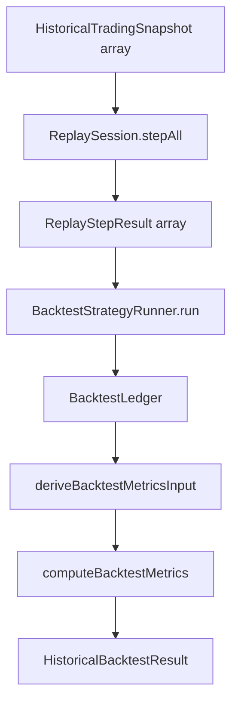

# PR-6.7A — Historical Backtest Orchestrator

## Summary

Milestone 6.7A adds `runHistoricalBacktest()` — the single orchestration entrypoint for running a complete deterministic historical backtest through the existing pipeline.

**Orchestration only** — no new trading logic, optimization, walk-forward, parameter sweeps, Monte Carlo, dashboard, persistence, or networking.

## Pipeline



## Input contract

```typescript
type RunHistoricalBacktestInput = {
  snapshots: readonly HistoricalTradingSnapshot[];
  strategy: BacktestStrategy;
  engineConfig: EngineConfig;
  initialCashCents: number;
  fillConfig?: BacktestFillSimulationConfig;
  metricsConfig?: {
    periodsPerYear?: number;
    riskFreeRatePerPeriod?: number;
  };
};
```

Unlike `runResearchExperiment()`, this entrypoint accepts `engineConfig` for `ReplaySession.create()`.

## Result contract

```typescript
type HistoricalBacktestResult = {
  replayResult: { results: readonly ReplayStepResult[] };
  strategyRun: BacktestStrategyRunResult;
  ledger: BacktestLedger;
  metrics: BacktestMetricsSummary;
  metadata: HistoricalBacktestMetadata;
};
```

`serializeHistoricalBacktestResult()` uses `stableStringify` for deterministic output.

## Shared metrics derivation

`deriveBacktestMetricsInput()` maps replay output + ledger fills into `ComputeBacktestMetricsInput` (equity curve + closed trades). Both `runHistoricalBacktest()` and `runResearchExperiment()` consume this public helper — no duplicated summary math.

### Accounting policy

- **Equity curve:** replays ledger fills step-by-step, then marks open positions using each step's `engineInput.pricing` mids (fallback to bid/ask mid when mids are absent).
- **Closed trades:** weighted-average cost basis per ticker/side; one `ClosedTradeSummary` per sell fill. Entry fees affect cash in the ledger but not cost basis (consistent with 6.5A).
- **Adapter tradeoff:** the adapter rebuilds a transient ledger while walking replay steps to produce the equity curve. This avoids duplicating mark-price logic but re-applies fills already recorded on the strategy-run ledger. A future refactor may read ledger snapshots directly once step-aligned balances are exposed.

### HistoricalBacktest vs ResearchExperiment

| Entrypoint | Use when |
|---|---|
| `runHistoricalBacktest()` | Single deterministic backtest with explicit `engineConfig`, fill config, and metrics config; returns full replay + strategy-run artifacts |
| `runResearchExperiment()` | Research workflow with experiment metadata, serializable `strategyConfig`, and frozen experiment configuration on the result |

Both share `deriveBacktestMetricsInput()` for metrics input — choose based on configuration and result shape needs, not metrics math.

### Future extraction

`compareFills` ordering (`occurredAt` → `sourceStepIndex` → `fillId`) is duplicated with ledger fill ordering conventions. Extract to a shared backtesting utility when a third consumer appears.

## Rules

- Consumes public APIs only (`ReplaySession`, `BacktestStrategyRunner`, `deriveBacktestMetricsInput`, `computeBacktestMetrics`)
- Immutable deep-frozen outputs
- Does not mutate input snapshots
- No replay, ledger, or metrics logic duplicated in the orchestrator

## Out of scope

- Optimization / ranking
- Walk-forward validation
- Parameter sweeps
- Monte Carlo
- Dashboard / UI
- Persistence

## Quality gates

```bash
npm run lint
npm run test
npm run build
```

## API

```typescript
import { runHistoricalBacktest } from "@/lib/data/backtesting";

const result = runHistoricalBacktest({
  snapshots,
  strategy: myStrategy,
  engineConfig: DEFAULT_ENGINE_CONFIG,
  initialCashCents: 100_000,
});
```
