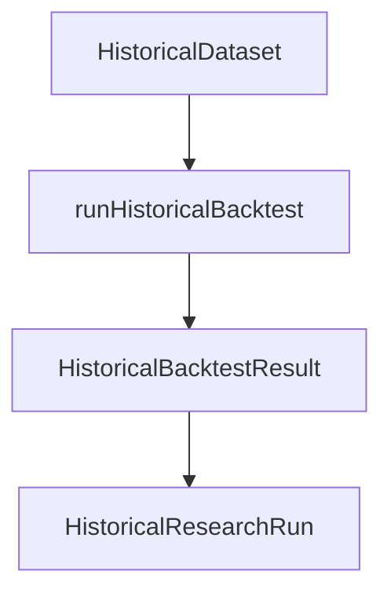

# PR-6.8A — Historical Research CLI

## Summary

Milestone 6.8A adds `HistoricalResearchCli` — the deterministic orchestration entrypoint for running complete historical backtests from `HistoricalDataset` objects.

**Orchestration only** — no trading logic, replay logic, metrics, optimization, persistence, filesystem I/O, console logging, or UI.

## Pipeline



`runAll()` repeats the pipeline sequentially for multiple datasets with optional progress callbacks.

## Public API

```typescript
import {
  HistoricalResearchCli,
  serializeHistoricalResearchRun,
} from "@/lib/data/cli";

const run = HistoricalResearchCli.run({
  dataset,
  config: {
    runId: "run-001",
    strategy,
    engineConfig,
    initialCashCents: 10_000,
    durationMs: 1_250, // caller-supplied; no Date.now()
    fillConfig,
    metricsConfig,
  },
  onProgress: (event) => { /* optional */ },
});

const runs = HistoricalResearchCli.runAll({
  datasets: [datasetA, datasetB],
  config,
  onProgress,
});
```

## Result contract

```typescript
type HistoricalResearchRun = {
  datasetMetadata: HistoricalDatasetMetadata;
  backtestResult: HistoricalBacktestResult;
  durationMs: number;
  config: HistoricalResearchRunConfig;
};
```

## Progress events

| Event | When |
|---|---|
| `started` | Before the first dataset backtest |
| `dataset-complete` | After each dataset finishes |
| `finished` | After all datasets complete |

Errors propagate immediately. Events are emitted synchronously with no buffering.

## Deterministic guarantees

- Datasets processed in caller-provided order (`runAll`)
- `durationMs` supplied by caller (no wall-clock timing)
- Deep-frozen outputs
- `serializeHistoricalResearchRun()` uses `stableStringify`
- Backtest serialization delegated to `serializeHistoricalBacktestResult()`

## Error codes

| Code | When |
|---|---|
| `empty-dataset` | Dataset has no snapshots |
| `empty-datasets` | `runAll` called with empty array |
| `missing-run-id` | Blank `runId` |
| `missing-strategy` | No strategy on config |
| `invalid-strategy-id` | Blank `strategy.strategyId` |
| `invalid-initial-cash` | Negative or non-finite `initialCashCents` |
| `invalid-duration-ms` | Negative or non-finite `durationMs` |
| `invalid-config` | Config is not a plain object |

## Tests

`HistoricalResearchCli.test.ts` covers:

- Successful single run
- Multiple datasets (`runAll`)
- Deterministic serialization
- Immutable outputs
- Progress callback ordering
- Optional callback
- Empty dataset rejection
- Invalid config rejection
- `runHistoricalBacktest` invoked once per dataset

## Out of scope

- Optimization, parameter sweep, walk-forward, Monte Carlo
- Persistence, dashboard, UI, networking
- Research comparison

## Dependencies

- 6.7A `runHistoricalBacktest()`
- 6.7B `HistoricalDataset`
