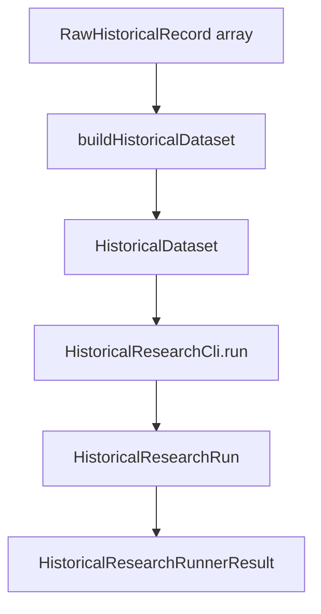

# PR-6.9A — Historical Research Runner

## Summary

Milestone 6.9A adds `runHistoricalResearchFromBronze()` — the first end-to-end research runner that accepts bronze records plus strategy configuration and returns a serialized historical research result.

**Orchestration only** — no filesystem, console, network, persistence, trading logic, or metrics logic.

## Pipeline



## Public API

```typescript
import {
  runHistoricalResearchFromBronze,
  serializeHistoricalResearchRunnerResult,
} from "@/lib/data/research/runner";

const result = runHistoricalResearchFromBronze({
  bronzeRecords,
  strategy,
  engineConfig,
  initialCashCents: 10_000,
  runId: "run-001",
  durationMs: 2_500, // caller-supplied; no Date.now()
  fillConfig,
  metricsConfig,
});
```

## Result contract

```typescript
type HistoricalResearchRunnerResult = {
  dataset: HistoricalDataset;
  researchRun: HistoricalResearchRun;
  serialized: string;
  metadata: {
    runId: string;
    durationMs: number;
    strategyId: string;
    datasetId: string;
    snapshotCount: number;
    bronzeRecordCount: number;
  };
};
```

`serialized` is produced via `serializeHistoricalResearchRunnerResult()`, which delegates dataset and research-run serialization to `serializeHistoricalDataset()` and `serializeHistoricalResearchRun()`.

## Error handling

| Layer | Behavior |
|---|---|
| Runner | Rejects empty bronze arrays and invalid top-level config before pipeline execution |
| Dataset builder | Errors propagate unchanged (`HistoricalDatasetBuildError`) |
| Research CLI | Errors propagate unchanged (`HistoricalResearchCliError`) |

## Entrypoints

| API | When to use |
|---|---|
| `HistoricalResearchCli.run()` | Caller already has a `HistoricalDataset` |
| `runHistoricalResearchFromBronze()` | Caller has `RawHistoricalRecord[]` and wants dataset build + research run in one call |

The runner validates bronze input shape and config fields before calling `buildHistoricalDataset()` and `HistoricalResearchCli.run()`. Config validation intentionally overlaps with the CLI layer so invalid requests fail before dataset construction.

## Deterministic guarantees

- No `Date.now()` or `Math.random()`
- Deep-frozen outputs
- `serializeHistoricalResearchRunnerResult()` uses `stableStringify`
- Bronze inputs are not mutated

## Tests

`HistoricalResearchRunner.test.ts` covers:

- Happy path from bronze to research run
- Empty bronze rejection
- Deterministic serialization
- Dataset builder invoked once
- `HistoricalResearchCli.run` invoked once
- Immutable output
- Input bronze unchanged
- Error propagation from dataset builder
- Error propagation from research CLI

## Dependencies

- 6.7B `buildHistoricalDataset()`
- 6.8A `HistoricalResearchCli.run()`

## Out of scope

- Optimization, parameter sweep, walk-forward, Monte Carlo
- Persistence, dashboard, UI, networking
- Filesystem and console I/O
